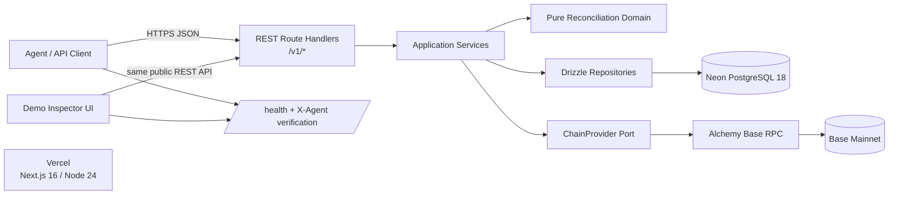

# SETTLE — Architecture

> **Status:** Hackathon MVP architecture  
> **Primary reader:** AI coding agents  
> **Source of product truth:** `product_brief.md` / `SETTLE_PRODUCT_BRIEF.md`  
> **Architecture rule:** If this file and an implementation choice conflict, this file wins until it is deliberately updated in the same change.

## 1. Overview

Settle is an API-first, read-only payment reconciliation service for autonomous agents. A caller declares an expected USDC payment, the payment happens independently, and Settle later queries Base to determine whether canonical onchain transfers satisfy that obligation. The API returns a deterministic payment status plus transaction evidence.

The v1 product is deliberately narrow:

- Base mainnet only.
- Native Circle USDC only.
- Anonymous payment intents identified by high-entropy opaque IDs.
- Caller-triggered reconciliation only.
- Partial-payment aggregation, overpayment detection, confirmation handling, evidence, and ambiguity handling.
- One lightweight inspector/demo UI.
- Public REST API, `/health`, and X-Agent verification endpoint.
- One Next.js deployment, one PostgreSQL database, one blockchain RPC provider.

**Non-goals for v1:** accounts, organizations, API-key issuance, wallets, signing, payment execution, custody, escrow, refunds, fiat conversion, swaps, subscriptions, compliance, wallet/security scoring, multi-chain support, background workers, webhooks, persistent chain indexing, Redis, queues, a full MCP server, or an elaborate dashboard.

The architectural principle is:

> **Stateless with respect to the chain; stateful with respect to payment obligations.**

Settle stores declared obligations, observed evidence, and reconciliation history. It does not maintain its own copy of Base.

---

## 2. Fixed stack

| Concern | Choice | Version | Reason |
|---|---|---:|---|
| Runtime | Node.js LTS | 24 | Stable LTS runtime supported by Vercel; use Node runtime, never Edge, for API routes. |
| Language | TypeScript | 6 | Strict typing across API, domain, database, and provider boundaries. |
| Web framework | Next.js App Router | 16 | One deployable app for REST routes plus the small inspector UI. |
| UI runtime | React | 19 | Bundled naturally with Next.js 16; no separate SPA architecture. |
| Database | Neon PostgreSQL | 18 | Managed relational persistence; fits intents, evidence, constraints, and transactions. |
| ORM/query layer | Drizzle ORM | 0.45.2 | Thin SQL-oriented layer with explicit migrations. Latest stable 0.x release; fixes the identifier/`sql.as` escaping security advisory while avoiding Drizzle 1.x prerelease risk. Do not adopt Drizzle 1.x beta in v1. |
| PostgreSQL driver | `pg` | 8 | Mature Node driver; use Neon’s pooled connection string and real interactive transactions. |
| EVM client | `viem` | 2 | Typed EVM RPC, address validation, ABI decoding, exact unit conversion. |
| Validation | Zod | 4 | Single runtime schema layer for request, config, and response-adjacent validation. |
| Styling | Tailwind CSS | 4 | Small inspector UI without adding a component framework. |
| Unit/service tests | Vitest | 4 | Fast TypeScript tests for deterministic reconciliation logic. |
| Browser tests | Playwright | 1 | Small number of end-to-end smoke tests for the demo UI and public API. |
| Hosting | Vercel | managed | Git previews and one production deployment. |
| Blockchain provider | Alchemy Base RPC | managed | Primary Base source; hidden behind `ChainProvider`. |
| Package manager | pnpm | 10 | Lockfile-driven deterministic installs. |

Do not add an authentication vendor, Redis, a job service, object storage, an indexer, a second RPC provider, a state-management library, or a UI component framework in v1.

### Network constants

These are code constants, not environment variables:

- Base mainnet chain ID: `8453`.
- Asset symbol: `USDC`.
- USDC decimals: `6`.
- Native Circle USDC on Base: `0x833589fCD6eDb6E08f4c7C32D4f71b54bdA02913`.
- Default required confirmations: `3`.
- Allowed confirmation range: `1..64`.
- Maximum intent lifetime: `7 days`.
- Maximum JSON request body: `16 KiB`.

Changing the chain, token contract, or decimals is an architecture change.

---

## 3. System diagram



The UI does not get a privileged internal API. It calls the same `/v1/*` routes that an external agent calls.

---

## 4. Data model

### 4.1 `payment_intents`

Represents one declared payment obligation.

| Column | Type | Rules |
|---|---|---|
| `id` | `varchar(40)` PK | `pi_` + 192 bits of cryptographic randomness encoded base64url. Never sequential. |
| `account_id` | `uuid` nullable | Reserved future ownership hook. Always `NULL` in v1. No accounts table in v1. |
| `external_reference` | `varchar(128)` nullable | Caller metadata; not globally unique. |
| `chain` | `varchar(16)` | Must equal `base`. |
| `asset` | `varchar(16)` | Must equal `USDC`. |
| `token_address` | `varchar(42)` | Canonical native Base USDC address. |
| `expected_amount_units` | `numeric(78,0)` | Exact integer token units; positive. |
| `recipient_address` | `varchar(42)` | Lowercase normalized EVM address. |
| `payer_address` | `varchar(42)` nullable | Lowercase normalized address when supplied. |
| `start_block` | `bigint` | Latest Base block at creation + 1. Excludes transfers that predate the intent. |
| `expiry_block` | `bigint` nullable | Resolved lazily once expiry is in the past. |
| `required_confirmations` | `smallint` | `1..64`, default `3`. |
| `status` | enum | `pending`, `detected`, `partial`, `paid`, `overpaid`, `expired`, `ambiguous`. |
| `received_amount_units` | `numeric(78,0)` | Confirmed, unambiguously associated amount at the last accepted reconciliation. |
| `detected_amount_units` | `numeric(78,0)` | Unambiguously associated amount including under-confirmed transfers. |
| `match_confidence` | enum | `none`, `exact_payer`, `single_sender`, `ambiguous`. |
| `paid_at` | `timestamptz` nullable | Timestamp of the transfer that first brought confirmed total to or above expected amount. |
| `last_reconciled_block` | `bigint` nullable | Newer observations may replace older; older observations may not overwrite newer state. |
| `last_reconciled_at` | `timestamptz` nullable | Server timestamp. |
| `created_at` | `timestamptz` | Server UTC. |
| `expires_at` | `timestamptz` | Must be after creation and no more than 7 days later. |
| `updated_at` | `timestamptz` | Server UTC. |

Indexes:

- primary key on `id`;
- `(status, expires_at)` for operational inspection;
- `(recipient_address, created_at)` for debugging/analysis only;
- no unique index on `external_reference`.

There is no soft-delete column and no delete endpoint in v1.

### 4.2 `matched_transfers`

Stores chain evidence observed while reconciling an intent. A row may be a deterministic match or merely a candidate when payer information is absent.

| Column | Type | Rules |
|---|---|---|
| `id` | `uuid` PK | Generated server-side. |
| `payment_intent_id` | FK | `ON DELETE RESTRICT`. |
| `tx_hash` | `varchar(66)` | Lowercase hex. |
| `log_index` | `integer` | ERC-20 event log index. |
| `block_number` | `bigint` | Base block. |
| `block_hash` | `varchar(66)` | Used to identify reorged evidence. |
| `from_address` | `varchar(42)` | Lowercase normalized sender. |
| `to_address` | `varchar(42)` | Must equal intent recipient. |
| `amount_units` | `numeric(78,0)` | Exact USDC base units. |
| `block_timestamp` | `timestamptz` | Timestamp of containing block. |
| `association` | enum | `matched`, `candidate`, `orphaned`. |
| `confirmations` | `integer` | Observation at last reconcile; cached evidence only. |
| `first_seen_at` | `timestamptz` | Server UTC. |
| `last_seen_at` | `timestamptz` | Server UTC. |

Constraints/indexes:

- unique `(payment_intent_id, tx_hash, log_index)` — this is the primary double-counting guard;
- index `(payment_intent_id, block_number, log_index)`;
- index on `tx_hash`;
- never count `candidate` or `orphaned` rows toward `received_amount_units`.

### 4.3 `reconciliation_attempts`

Operational history for debugging and hackathon evidence; do not store raw provider payloads.

| Column | Type |
|---|---|
| `id` | `uuid` PK |
| `payment_intent_id` | FK |
| `request_id` | `varchar(64)` |
| `provider` | `varchar(32)`; `alchemy` in v1 |
| `from_block` | `bigint` |
| `to_block` | `bigint` |
| `latest_block` | `bigint` nullable |
| `candidate_count` | `integer` default 0 |
| `result_status` | payment status nullable |
| `error_code` | `varchar(64)` nullable |
| `started_at` | `timestamptz` |
| `completed_at` | `timestamptz` |
| `duration_ms` | `integer` |

Index `(payment_intent_id, started_at desc)`.

### 4.4 Money, addresses, and time

- API money is always a decimal string, e.g. `"850.00"`.
- Domain money is always `bigint` token units.
- PostgreSQL stores token units as `numeric(78,0)`; repositories convert string ⇄ `bigint`.
- Never use JavaScript `number` for money.
- Parse and format USDC with six decimals; reject more than six fractional digits.
- Validate EVM addresses with `viem`; store lowercase for equality; format checksum addresses only at response/display boundaries.
- Store all timestamps as PostgreSQL `timestamptz`; API timestamps are UTC ISO-8601 strings ending in `Z`.
- Block numbers are `bigint` in TypeScript and `bigint` in PostgreSQL.
- IDs are strings; do not expose database sequence IDs.

---

## 5. Directory structure

```text
.
├── ARCHITECTURE.md
├── README.md
├── SETTLE_PRODUCT_BRIEF.md
├── .env.example
├── drizzle.config.ts
├── package.json
├── pnpm-lock.yaml
├── next.config.ts
├── tsconfig.json
├── vitest.config.ts
├── playwright.config.ts
├── drizzle/
│   └── *.sql                       # generated, committed schema migrations
├── public/
│   └── ...                         # static UI assets only
├── src/
│   ├── app/
│   │   ├── page.tsx                # demo/create-intent UI
│   │   ├── inspect/[id]/page.tsx   # payment inspector
│   │   ├── health/route.ts
│   │   ├── .well-known/
│   │   │   └── xagent-verification.json/route.ts
│   │   └── v1/
│   │       └── payment-intents/
│   │           ├── route.ts        # POST create only
│   │           └── [id]/
│   │               ├── route.ts    # GET intent
│   │               ├── reconcile/route.ts
│   │               └── evidence/route.ts
│   ├── components/
│   │   └── ...                     # presentation and client polling only
│   ├── domain/
│   │   ├── payment-intent.ts       # domain types/status enums
│   │   ├── reconciliation.ts       # pure matching/status calculation
│   │   └── money.ts                # exact-unit domain helpers
│   ├── services/
│   │   ├── create-payment-intent.ts
│   │   ├── get-payment-intent.ts
│   │   ├── reconcile-payment-intent.ts
│   │   └── get-payment-evidence.ts
│   ├── ports/
│   │   ├── chain-provider.ts       # ChainProvider interface
│   │   └── payment-repository.ts   # persistence interface
│   ├── repositories/
│   │   └── drizzle-payment-repository.ts
│   ├── integrations/
│   │   └── chain/
│   │       ├── alchemy-base-provider.ts
│   │       └── base-usdc.ts        # chain/token constants + Transfer ABI
│   ├── db/
│   │   ├── client.ts
│   │   └── schema.ts
│   ├── validation/
│   │   └── payment-intents.ts
│   ├── server/
│   │   └── container.ts            # constructs concrete services/adapters
│   └── lib/
│       ├── config.ts
│       ├── errors.ts
│       ├── http.ts
│       ├── ids.ts
│       ├── logger.ts
│       └── request-body.ts
└── tests/
    ├── unit/
    ├── service/
    ├── integration/
    └── e2e/
```

Do not create `backend/`, `api/`, `server/` at the repository root, a second Next.js app, or a generic `utils/` dumping ground.

---

## 6. Layers and dependency boundaries

Allowed dependency direction:

```text
Next.js route handlers
        ↓
application services
        ↓
domain + ports
        ↑
repositories / chain integrations
```

`src/server/container.ts` is the composition root that wires concrete adapters into services.

Hard rules:

- `src/domain/**` is pure TypeScript. It may not import Next.js, Drizzle, `pg`, `viem`, environment variables, or network code.
- `src/services/**` contains use-case orchestration. It imports domain types and port interfaces, not Alchemy or Drizzle implementations.
- `src/repositories/**` is the only layer that performs application database queries.
- `src/integrations/chain/**` is the only layer that imports `viem` RPC clients or knows Alchemy transport details.
- Route handlers validate HTTP input, call one service, and map the result to HTTP. They contain no reconciliation or SQL logic.
- UI components never import repositories, database modules, services, or chain adapters. The inspector uses the public REST API.
- `db`, repositories, integrations, services, and `server/container.ts` are server-only modules. Add `import "server-only"` where appropriate.
- Client state is local React state. Do not add Redux, Zustand, TanStack Query, SWR, or another client-state/data library in v1.

---

## 7. Reconciliation rules

The reconciliation engine is conservative and deterministic.

### 7.1 Query window

On intent creation:

1. validate request;
2. read the latest Base block through `ChainProvider`;
3. persist `start_block = latestBlock + 1`;
4. return the intent.

A provider failure during creation returns a retryable upstream error and does not create an intent. This is intentional: the start block is part of the matching boundary.

On reconciliation:

- `fromBlock = intent.start_block`;
- if `now <= expires_at`, `toBlock = latestBlock`;
- if `now > expires_at`, resolve the greatest canonical block whose timestamp is `<= expires_at`, persist it as `expiry_block`, and use that as `toBlock`;
- never inspect transfers mined after the expiry boundary;
- `ChainProvider` owns any block lookup/binary-search mechanics.

### 7.2 Transfer discovery and log verification

The Alchemy adapter discovers candidate transactions with the Alchemy Transfers API (`alchemy_getAssetTransfers`), which performs filtered historical transfer discovery over the whole window in one paginated query, and then verifies every discovered transaction from its canonical EVM transaction receipt, decoding the native Base USDC `Transfer(address,address,uint256)` logs with `viem`. Only receipt/log data becomes evidence; the Transfers API's human-readable values are never used for money.

Discovery always filters by:

- token contract;
- `to = recipient`;
- block range;
- `category = erc20`.

When `payer` exists, also filter by `from = payer` at the provider level.

Verification re-applies the contract, recipient, payer (when declared) and block-range filters to the decoded logs, keeps every matching log of a transaction (identity is `tx_hash + log_index`), and fails the whole operation on any discovery, pagination, receipt or decoding failure — a partial scan is never returned.

The design remains compatible with Alchemy Free's 10-block `eth_getLogs` restriction because reconciliation no longer relies on wide-range `eth_getLogs` queries.

The reconciliation engine never imports Alchemy-specific response types.

### 7.3 Association

If a payer was supplied:

- all canonical in-window USDC transfers from that payer to the recipient are `matched`;
- confidence is `exact_payer`.

If no payer was supplied:

- group candidate transfers by sender;
- zero sender groups means no match;
- exactly one sender group may be associated and confidence is `single_sender`;
- two or more sender groups makes the intent `ambiguous`; those rows remain `candidate` and **none** are counted as received.

Do not invent scoring, heuristics, ML matching, memo parsing, or “best candidate” selection.

### 7.4 Confirmations and status

For a transfer in block `B` with current latest block `L`:

```text
confirmations = L - B + 1
```

This is Base block confirmation depth only. v1 does not model L1 finality.

Calculate:

- `detectedAmount` = matched canonical transfers regardless of confirmation depth;
- `receivedAmount` = matched canonical transfers whose confirmations meet `required_confirmations`.

Status precedence:

1. `ambiguous` — multiple plausible sender groups without declared payer.
2. `overpaid` — confirmed amount `>` expected amount.
3. `paid` — confirmed amount `==` expected amount.
4. `partial` — confirmed amount is `> 0` and `<` expected amount, while intent has not conclusively expired.
5. `detected` — no confirmed amount, but at least one unambiguous under-confirmed transfer exists.
6. `expired` — expiry boundary has passed and confirmed amount is below expected with no under-confirmed pre-expiry transfer that could still satisfy it.
7. `pending` — none of the above.

A transfer mined before `expires_at` may become sufficiently confirmed after `expires_at`; confirmation time is not payment time.

`paid_at` is the block timestamp of the transfer that causes cumulative confirmed amount, ordered by `(block_number, log_index)`, to first reach the expected amount.

### 7.5 Idempotency and concurrency

Reconciliation is idempotent by construction:

- transfer identity is unique on `(payment_intent_id, tx_hash, log_index)`;
- upserts update evidence rather than insert duplicates;
- amounts are recomputed from canonical persisted evidence, never incremented blindly;
- provider calls happen outside the database transaction;
- applying results happens inside a PostgreSQL transaction;
- lock the `payment_intents` row with `SELECT ... FOR UPDATE` while applying evidence/state;
- an observation whose `latestBlock < last_reconciled_block` may be recorded as an attempt but must not overwrite intent state.

If a previously observed transfer is proven non-canonical, mark it `orphaned` and recompute state. Do not preserve a `paid` status against contradictory canonical evidence merely to make statuses look monotonic.

Provider failure never mutates payment status or transfer associations.

---

## 8. Key flows

### 8.1 Create a payment intent

```text
POST /v1/payment-intents
→ route validates body and size
→ createPaymentIntent service
→ ChainProvider.getLatestBlock()
→ generate pi_<192-bit random id>
→ repository inserts intent with start_block = latest + 1
→ route returns 201
```

No wallet interaction occurs.

### 8.2 Reconcile payment

```text
POST /v1/payment-intents/:id/reconcile
→ route validates opaque ID
→ reconcilePaymentIntent service loads intent
→ ChainProvider resolves latest / expiry block
→ ChainProvider fetches native USDC Transfer logs
→ domain reconciliation classifies candidates and computes status
→ repository transaction locks intent
→ evidence upsert + orphan handling + status update
→ reconciliation_attempt recorded
→ route returns current structured state + evidence summary
```

If Alchemy is unavailable, return a retryable upstream error and leave intent state unchanged.

### 8.3 Demo inspector polling

```text
/inspect/:id
→ browser GETs /v1/payment-intents/:id
→ while page is open, browser POSTs /reconcile every 7 seconds
→ update status/evidence UI
→ stop polling when status is paid, overpaid, expired, or ambiguous
```

This is browser-driven polling only. No server scheduler, listener, cron, queue, or webhook exists.

---

## 9. API design

Style: JSON REST with camelCase fields.

### Routes

```text
POST /v1/payment-intents
GET  /v1/payment-intents/:id
POST /v1/payment-intents/:id/reconcile
GET  /v1/payment-intents/:id/evidence

GET  /health
GET  /.well-known/xagent-verification.json
```

There is no list-all-intents endpoint in v1. Opaque IDs are the capability boundary and must not be enumerable.

### Create request

Required:

- `chain: "base"`
- `asset: "USDC"`
- `amount: decimal string`
- `recipient: address`
- `expiresAt: UTC timestamp`

Optional:

- `externalReference`
- `payer`
- `requiredConfirmations` (defaults to 3)

Reject unknown fields.

### Response shape

Successful resource responses stay top-level, matching the product brief; do not wrap them in a generic `data` envelope. Reconciliation responses include the payment state directly, for example:

```json
{
  "id": "pi_...",
  "status": "paid",
  "expectedAmount": "850.00",
  "receivedAmount": "850.00",
  "remainingAmount": "0.00",
  "asset": "USDC",
  "chain": "base",
  "matchConfidence": "exact_payer",
  "paidAt": "2026-09-17T14:31:02Z"
}
```

Every response includes an `X-Request-Id` header. Errors use the brief's top-level error object:

```json
{
  "error": {
    "code": "UPSTREAM_UNAVAILABLE",
    "message": "Blockchain provider is temporarily unavailable",
    "retryable": true
  }
}
```

Stable error codes:

- `VALIDATION_ERROR` — 400
- `INVALID_ADDRESS` — 400
- `UNSUPPORTED_CHAIN` — 400
- `UNSUPPORTED_ASSET` — 400
- `INTENT_NOT_FOUND` — 404
- `RATE_LIMITED` — 429
- `UPSTREAM_UNAVAILABLE` — 503
- `UPSTREAM_INVALID_RESPONSE` — 502
- `INTERNAL_ERROR` — 500

`ambiguous`, `pending`, `partial`, `expired`, etc. are successful domain results, not HTTP errors.

### Evidence pagination

`GET /evidence` accepts:

- `limit`, default `50`, max `100`;
- opaque `cursor`.

Order by `(block_number asc, log_index asc, tx_hash asc)`. The cursor is a base64url-encoded tuple of those three values. Never use offset pagination.

---

## 10. Authentication and authorization

v1 has **no users, sessions, organizations, OAuth, or API keys**.

Access model:

- `POST /v1/payment-intents` is public subject to rate limiting.
- Every intent ID contains 192 bits of cryptographic randomness.
- Possession of the opaque intent ID is the capability required to read or reconcile that intent.
- There is no route that enumerates IDs.
- `account_id` exists only as a nullable future schema hook.

Do **not** implement `intent_secret` opportunistically. It is deferred from the required hackathon MVP. If this decision changes, add a decision-log entry and migration; store only a hash of the secret and return cleartext once.

Phase 2 replaces anonymous capability-only access with account-scoped API keys without changing the reconciliation domain model.

---

## 11. Cross-cutting conventions

### Errors

Domain/service code throws typed application errors from `src/lib/errors.ts`. Route handlers are the only place that maps them to HTTP status codes and API error objects.

Never return raw SQL, `pg`, Drizzle, viem, or Alchemy errors to clients.

### Logging

Emit one-line structured JSON to stdout/stderr through `src/lib/logger.ts`.

Every API log includes:

- `requestId`;
- route;
- method;
- response status;
- duration;
- intent ID prefix only, not full ID, when useful;
- reconciliation result status/candidate count.

Never log:

- `DATABASE_URL`;
- Alchemy URL/API key;
- full request bodies;
- `externalReference`;
- payer/recipient addresses by default;
- raw provider payloads.

### Configuration

Validate environment variables once in `src/lib/config.ts`.

Required production variables:

```text
DATABASE_URL              # Neon pooled runtime URL
DATABASE_URL_UNPOOLED     # direct URL used by migration tooling
ALCHEMY_BASE_RPC_URL      # server-only; contains provider credential
XAGENT_SLUG               # final registered hackathon slug
```

Platform-provided:

```text
VERCEL_GIT_COMMIT_SHA
VERCEL_ENV
NODE_ENV
```

Optional:

```text
LOG_LEVEL=info
```

Do not put secrets in any `NEXT_PUBLIC_*` variable.

Chain ID, USDC address, decimals, confirmation defaults, expiry limits, and body limits are code constants, not deployment configuration.

### Naming

- files: kebab-case;
- React components/types/classes: PascalCase;
- functions/variables: camelCase;
- database tables/columns: snake_case;
- API JSON: camelCase;
- status/error enum values: lowercase status strings and `UPPER_SNAKE_CASE` error codes.

### State

No global client store. The URL holds the inspected intent ID; React local state holds transient UI state.

---

## 12. Security baseline

Settle never accepts or stores private keys, seed phrases, signing keys, exchange credentials, or wallet sessions.

Required v1 controls:

- Zod validation on every untrusted request.
- `viem` address validation and normalization.
- Exact integer money conversion; reject negative, zero, exponent notation, NaN-like strings, and more than six decimals.
- Reject unknown request fields.
- 16 KiB maximum JSON body, enforced by a bounded body reader rather than trusting `Content-Length` alone.
- Intent expiry must be in the future and at most 7 days from creation.
- Required confirmations must be `1..64`.
- Parameterized database access only through Drizzle/`pg`.
- RPC URL is server-only.
- No user-controlled RPC URL, token contract, chain ID, SQL fragment, or ABI.
- CORS is not wildcard-configured by application code unless the hackathon explicitly requires browser calls from third-party origins. Same-origin demo UI needs no permissive CORS.
- Security headers use Next.js/Vercel defaults plus explicit `X-Content-Type-Options: nosniff`, `Referrer-Policy: no-referrer`, and a restrictive Content Security Policy for the demo UI.
- No HTML rendering of `externalReference`; render as text only.

### Rate limiting

Production `/v1/*` traffic is rate-limited by Vercel Firewall by source IP. Configure and document these rules as part of deployment:

- all `/v1/*`: 60 requests/minute/IP;
- `POST /v1/payment-intents`: 10 requests/minute/IP;
- `POST */reconcile`: 30 requests/minute/IP.

Do not add Redis solely for rate limiting.

The app must still enforce semantic abuse bounds (body size, expiry, confirmations) even if the firewall is misconfigured.

### Product-specific risks

The main correctness risk is a **false positive `paid` result**. Therefore:

- do not match the wrong token contract;
- do not count post-expiry transfers;
- do not count duplicate logs;
- do not count ambiguous sender groups;
- do not convert money through floating point;
- do not advance state when RPC evidence cannot be fetched;
- do not silently treat provider errors as “no payment found.”

---

## 13. Testing strategy

Tests exist to catch cross-session agent drift, especially around money, matching, and boundaries.

### Required unit tests

`tests/unit` must exhaustively cover the pure domain logic:

- decimal string ⇄ USDC units;
- exact, partial, and overpayment;
- multiple transfers aggregating exactly once;
- duplicate transfer identity;
- required confirmation boundary;
- under-confirmed `detected`;
- expiry precedence;
- payment mined before expiry but confirmed after expiry;
- payer-specified matching;
- no-payer single-sender matching;
- no-payer multiple-sender ambiguity;
- zero-candidate pending/expired;
- ordering used to derive `paidAt`;
- orphaned evidence excluded.

### Required service tests

Use in-memory fakes implementing the port interfaces. Cover:

- provider failure does not mutate intent state;
- creation fails cleanly if start block cannot be established;
- older reconciliation observations cannot overwrite newer ones;
- reconciliation applies evidence transactionally;
- response/error mapping uses stable codes.

Do not mock private functions. Test through service entry points.

### Database integration tests

Run against a dedicated Neon test/preview database, never production. Cover:

- migration applies cleanly;
- unique transfer constraint prevents duplicates;
- row-lock/concurrent reconcile behavior;
- numeric token-unit round trips;
- cascade/restrict behavior.

### E2E smoke tests

Keep Playwright small:

1. create intent through public API;
2. open inspector;
3. fixture/stub provider mode in test environment produces a known transfer;
4. inspector moves to expected state;
5. health endpoint exposes commit field;
6. verification route returns the required schema.

Production code may have a test-only `FixtureChainProvider` selected only when `NODE_ENV === "test"`. It must never be selectable from a production environment variable.

Required CI checks:

```text
pnpm lint
pnpm typecheck
pnpm test
pnpm build
```

Database integration/E2E jobs may require test secrets and run separately, but must be green before final submission.

---

## 14. Environments and deployment

### Local

- Node 24 and pnpm 10.
- `.env.local` points to a Neon development branch/database and an Alchemy Base endpoint.
- Run `pnpm db:migrate`, then `pnpm dev`.
- Do not add Docker Compose for v1.

### Preview

Every pull request gets a Vercel preview deployment.

Preview deployments use:

- a non-production Neon database/branch;
- a non-production Alchemy credential;
- the same Base mainnet read path unless tests explicitly use fixtures.

Never point preview URLs at the production database.

### Production

Production is one Vercel project using the Node runtime and one Neon production database.

Deployment order for schema-changing commits:

1. CI passes.
2. Review generated SQL migration.
3. Apply backward-compatible migration with `pnpm db:migrate` using `DATABASE_URL_UNPOOLED`.
4. Deploy/promote the reviewed Git commit to Vercel.
5. Verify `/health`.
6. Verify `/.well-known/xagent-verification.json`.
7. Run one documented reconciliation curl.

Never run migrations from request handlers, application startup, or `next build`.

`/health` must expose the exact 40-character `VERCEL_GIT_COMMIT_SHA` in production. The verification route must use that same value. If the commit or required X-Agent slug is unavailable in production, the verification endpoint returns 500 rather than fabricated data.

The exact X-Agent verification JSON schema must come from the official hackathon submission package; do not invent fields not specified there.

---

## 15. Rules for AI coding agents

1. Read this entire file before editing code.
2. Do not add a runtime dependency unless it is listed in the stack or this file is updated with the decision and reason.
3. Do not add a new top-level directory without updating this file.
4. Do not put business logic in Next.js route handlers or React components.
5. Do not import Drizzle, `pg`, Alchemy, or `viem` RPC clients into `src/domain`.
6. Do not let reconciliation services import the concrete Alchemy adapter; depend on `ChainProvider`.
7. Do not represent USDC with JavaScript `number`.
8. Do not make chain/token constants configurable through request input or environment variables.
9. No schema change without a committed Drizzle migration.
10. No new table “for future use” except the already-approved nullable `account_id` hook.
11. No background jobs, cron, queues, webhooks, WebSockets, Redis, or persistent chain listeners in v1.
12. No auth/account/API-key system in v1.
13. No wallet connection or transaction execution.
14. A provider failure must never produce or preserve new positive payment evidence.
15. Before inventing a pattern, find and follow the nearest existing pattern in the repo.
16. Preserve stable API field names, status values, and error codes once tests exist.
17. Update `ARCHITECTURE.md` in the same commit whenever an architectural decision changes.
18. After every milestone, the repository must lint, typecheck, test, build, and run.

---

## 16. Decision log

| Decision | Context and choice | Rejected |
|---|---|---|
| One Next.js app | API and inspector are small enough for one deployable Vercel artifact. | Separate frontend/backend services; microservices. |
| PostgreSQL + Drizzle | Obligations/evidence need transactions, uniqueness, and relational constraints. | MongoDB; in-memory persistence. |
| Neon + `pg` | Managed Postgres plus pooled Node connections and interactive transactions. | Self-hosted DB; Redis; Neon HTTP-only driver where session locks are needed. |
| Public capability API | Hackathon needs low-friction calling; opaque 192-bit IDs prevent enumeration. | Accounts/API-key issuance in v1. |
| No `intent_secret` in required v1 | Extra secret handling is useful but not required to demonstrate reconciliation. | Leaving it “optional” for agents to implement inconsistently. |
| Base + native USDC only | Product brief intentionally fixes one rail and removes FX/token ambiguity. | Multi-chain/asset abstractions exposed to callers. |
| Alchemy behind `ChainProvider` | Provider choice must not leak into reconciliation logic. | Direct Alchemy calls from services; second provider in v1. |
| On-demand transfer discovery + receipt verification | Caller-triggered reconciliation matches MVP scope and avoids chain infrastructure. Alchemy Transfers API discovers candidates; canonical receipts provide exact evidence; independent of the plan's `eth_getLogs` block-range limit. | Indexer DB; WebSocket listener; cron scanner; wide-range `eth_getLogs` (fails on Alchemy Free beyond 10 blocks); tiny-range `eth_getLogs` chunking. |
| `start_block = latest + 1` | Prevents pre-intent transfers from satisfying a newly created obligation. | Scanning by timestamp alone. |
| Exact integer token units | Payment correctness cannot depend on binary floating point. | `number`, floating SQL types. |
| Conservative no-payer matching | Multiple plausible senders must not create false certainty. | Heuristic scoring or choosing the closest amount. |
| UI calls public API | Demo should prove the real capability rather than a privileged code path. | Direct DB/service calls from UI. |
| Vercel Firewall rate limits | Meets public-API abuse requirement without another datastore. | Redis-based limiter. |
| Stable Drizzle 0.45.2 | v1 favors documented stable behavior; 0.45.2 is the latest stable 0.x release and fixes the identifier/`sql.as` escaping security advisory (GHSA-gpj5-g38j-94v9) while avoiding Drizzle 1.x prerelease risk. | Drizzle 1.x beta/RC during hackathon; staying on 0.44.x with a known advisory. |

---

## 17. Build order

Feed these milestones to the coding agent one at a time. Each milestone ends with a runnable application.

### Milestone 0 — Scaffold, contracts, and public deployment shell

Deliver:

- Next.js/TypeScript/Tailwind project;
- strict TypeScript and linting;
- environment validation;
- structured logger/error envelope helpers;
- `/health`;
- X-Agent verification route with a tested placeholder contract awaiting the official schema;
- Vercel configuration;
- CI commands.

**Definition of done:** app runs locally, builds, deploys, and health reports the current commit field.

### Milestone 1 — Persistence and create/read vertical slice

Deliver:

- Drizzle schema and first migration;
- Neon connection;
- ID/money/address validation;
- `ChainProvider` port;
- Alchemy Base adapter with `getLatestBlock`;
- `POST /v1/payment-intents`;
- `GET /v1/payment-intents/:id`;
- unit/service tests.

**Definition of done:** a real intent can be created, persisted with `start_block`, and read back through the public API.

### Milestone 2 — Exact-payer reconciliation

Deliver:

- USDC `Transfer` decoding through viem;
- Base block/log queries;
- required-confirmation calculation;
- pure domain status engine for `pending`, `detected`, `paid`;
- evidence persistence;
- reconciliation-attempt persistence;
- `POST /reconcile`;
- `GET /evidence`;
- provider failure behavior.

**Definition of done:** one real payer → recipient Base USDC transfer can move an intent from pending/detected to paid with transaction evidence.

### Milestone 3 — Reconciliation completeness

Deliver:

- multiple-transfer aggregation;
- `partial`;
- `overpaid`;
- expiry block resolution;
- `expired`;
- no-payer single-sender association;
- multi-sender `ambiguous`;
- reorg/orphan evidence handling;
- concurrent/idempotent apply transaction.

**Definition of done:** the complete v1 state model is covered by tests and repeated reconciliation never double-counts.

### Milestone 4 — Inspector/demo UI

Deliver:

- create-intent form;
- `/inspect/:id`;
- expected/received/remaining/status/evidence display;
- transaction hash links;
- “Reconcile now”;
- copyable curl/API call;
- 7-second client polling while page is open.

**Definition of done:** the under-two-minute demo can show intent → real payment → detected/paid without any privileged backend path.

### Milestone 5 — Abuse and failure hardening

Deliver:

- bounded 16 KiB JSON reader;
- expiry/confirmation hard limits;
- stable error codes;
- security headers;
- Vercel Firewall rate-limit configuration documented and applied;
- redaction tests/log review;
- upstream timeout/retry classification;
- database concurrency tests.

**Definition of done:** malformed or abusive calls are bounded, provider outages cannot create positive state, and secrets/private metadata do not appear in logs.

### Milestone 6 — Submission hardening

Deliver:

- exact official X-Agent verification schema and slug;
- exact commit reporting;
- README API examples;
- `.env.example`;
- reproducible setup;
- final curl proof;
- final integration/E2E run;
- required submission package (`SUBMISSION.md`, `submission.json`, `RIGHTS.md`, `source/`, `verification/README.md`) if the hackathon requires those paths.

**Definition of done:** clean checkout passes required checks, deployed commit matches reviewed source, and one real Base USDC payment reconciles successfully.

---

## 18. Assumptions and open questions

### Assumptions

- Production reconciliation uses Base **mainnet**, because the brief requires a real Base USDC demo.
- The Alchemy deployment plan is Alchemy Free. Its `eth_getLogs` is limited to a 10-block range, so transfer discovery uses the Alchemy Transfers API and canonical transaction receipts instead (§7.2). Settle does not build thousands of tiny free-tier range requests.
- The final hackathon slug is supplied through `XAGENT_SLUG`.
- Anonymous intent IDs are acceptable as the v1 capability boundary; there is no public intent listing.
- Automatic data-retention deletion is deferred because v1 has no worker/cron. The schema intentionally stores only payment metadata and public-chain evidence rather than personal data.

### Open question outside the core architecture

The product brief requires `/.well-known/xagent-verification.json` but does not provide the official JSON schema or final registered slug. Before Milestone 6, copy the current official schema into a test fixture and make the route conform exactly. Do not infer it from this document.

---

## 19. Architecture invariants

A change is architecturally wrong for the hackathon MVP if it violates any of these:

1. Settle never signs or sends a transaction.
2. A `paid`/`overpaid` result is backed by canonical native Base USDC `Transfer` evidence.
3. Money is exact integer token units internally.
4. Reconciliation is repeatable without double counting.
5. Ambiguous evidence is reported as ambiguous, not guessed.
6. Provider failure cannot create positive payment state.
7. The API can operate without a continuously running chain process.
8. Alchemy is replaceable through `ChainProvider` without rewriting domain logic.
9. The demo UI uses the same public API as an agent.
10. The whole v1 remains one deployable app, one relational database, and managed external services.
